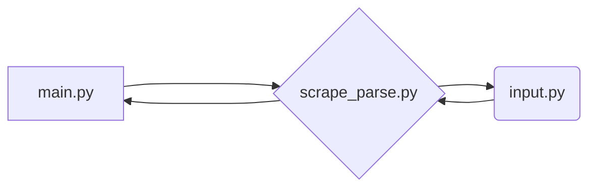

# Welcome to Scrapymon!

 **Scrapymon**
A tool that scrapes data from websites and saves it in either html, csv, json or txt format.

## Flow Chart 

```mermaid
graph LR
A[main.py] ----> B((scrape_parse.py))
B --> C(input.py)
C --> B{scrape_parse.py}
B --> A


```
**Copyright**
**&copy; Cyber_Admon**
